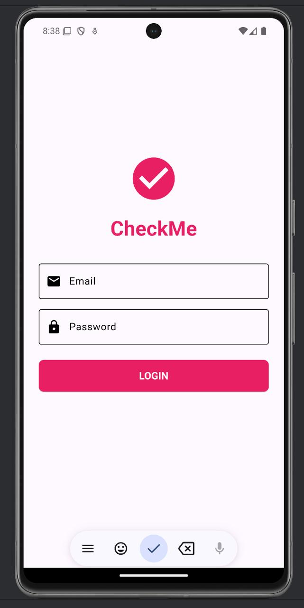
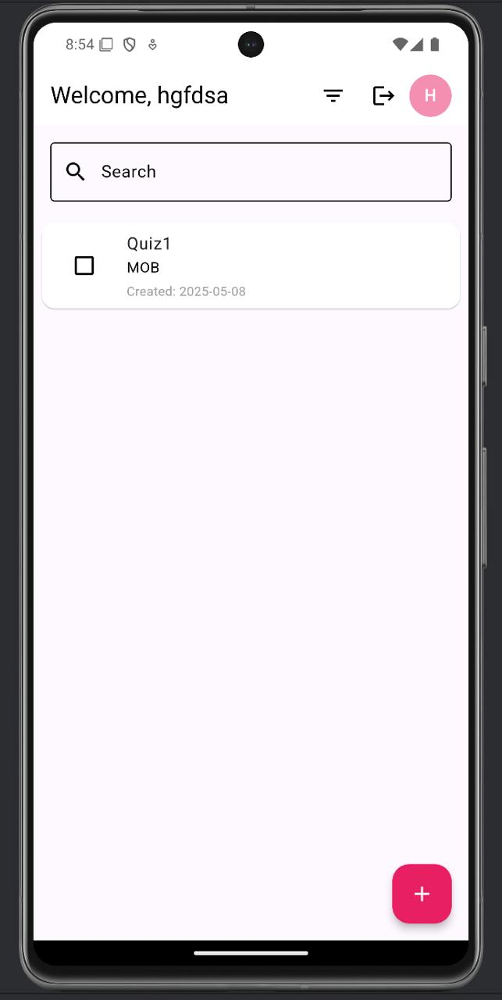
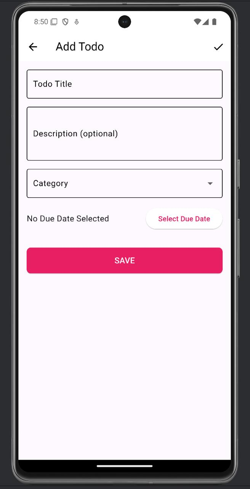
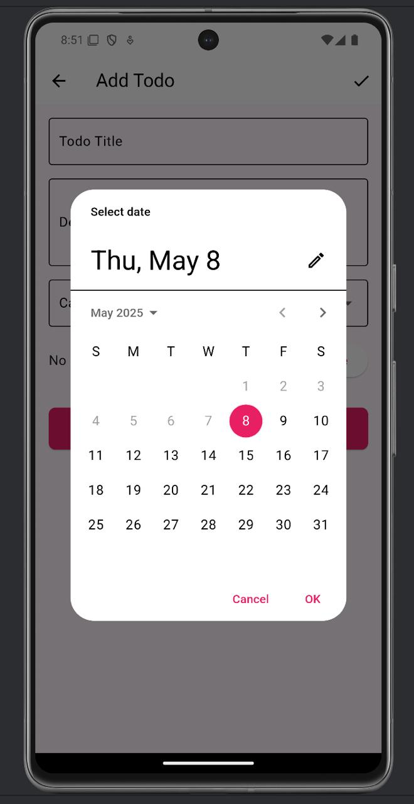
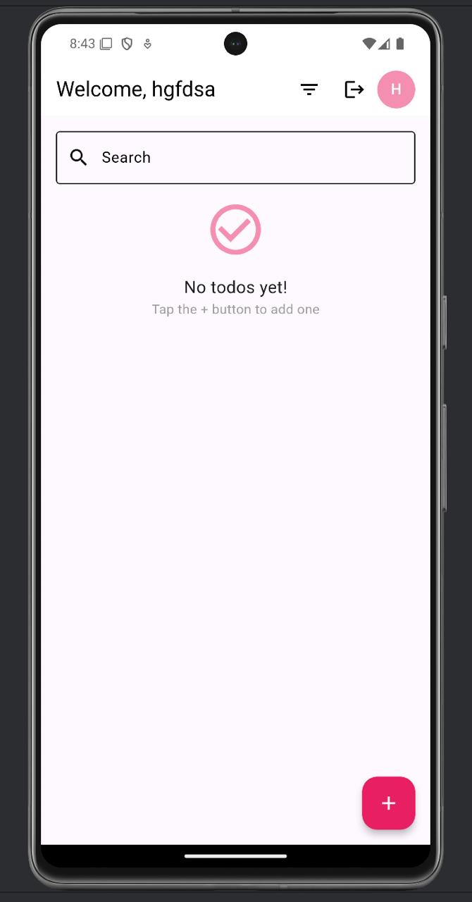

 # CheckMe – Todo App

A simple **Todo List App** built with **Flutter** and developed in **Android Studio**.  
It allows users to add, manage, search, filter, and track their tasks easily.

## ✨ Features

- Add, delete, and update todos
- Mark tasks as completed or pending
- Search bar for quick filtering
- Filter by All, Completed, or Pending tasks
- Task detail view
- Due date & overdue highlight
- Dark mode support (with Riverpod) [Upcoming]
- Undo delete (via SnackBar)

 
